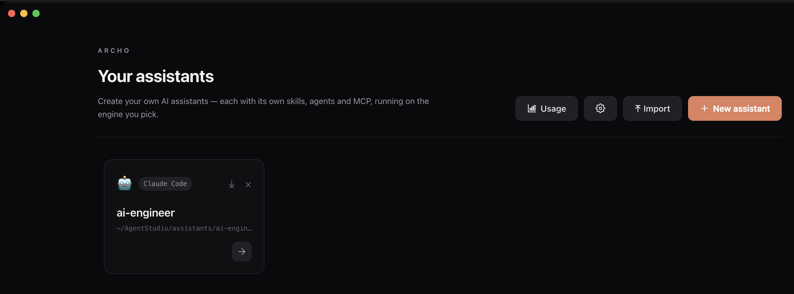
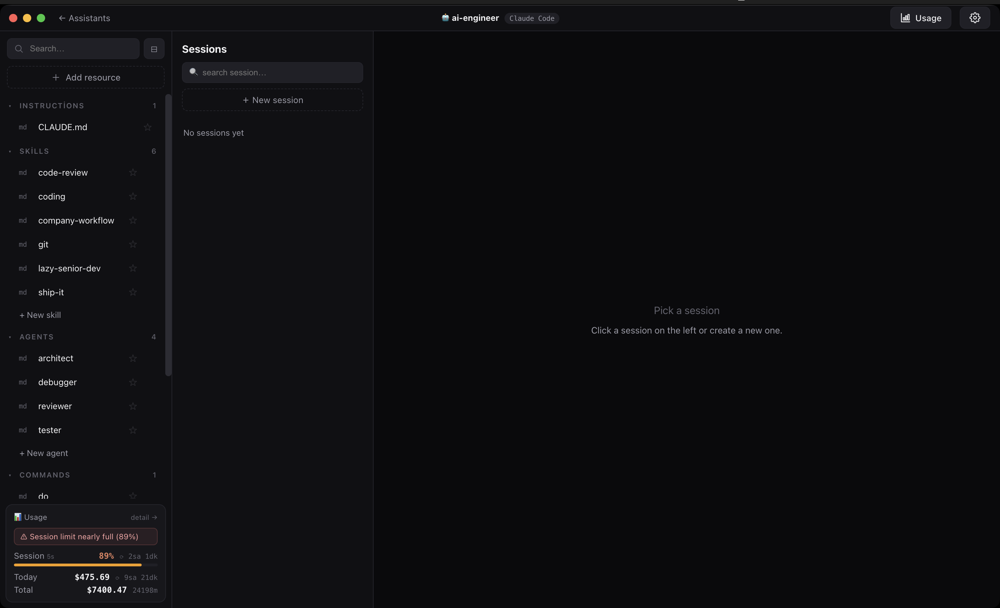
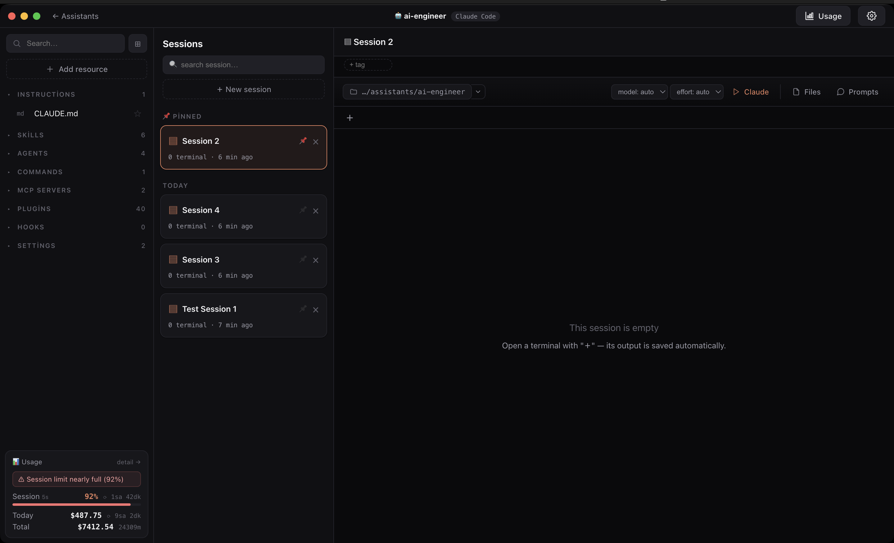
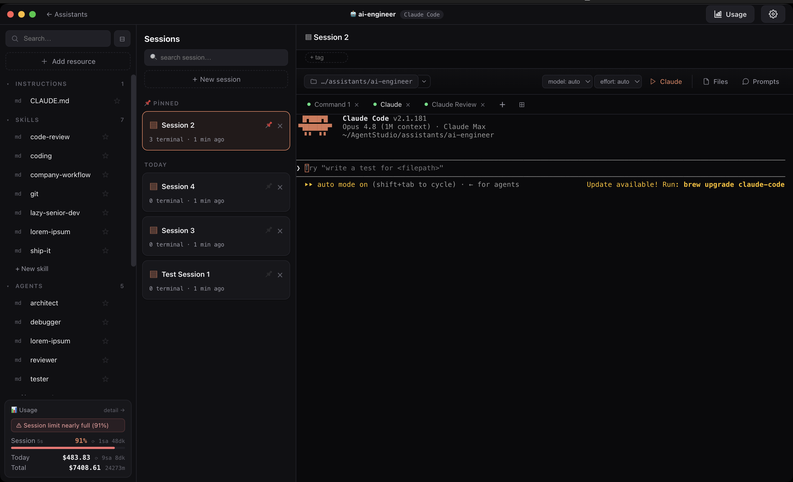
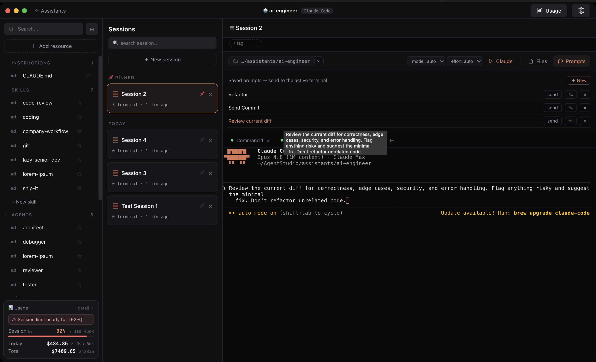
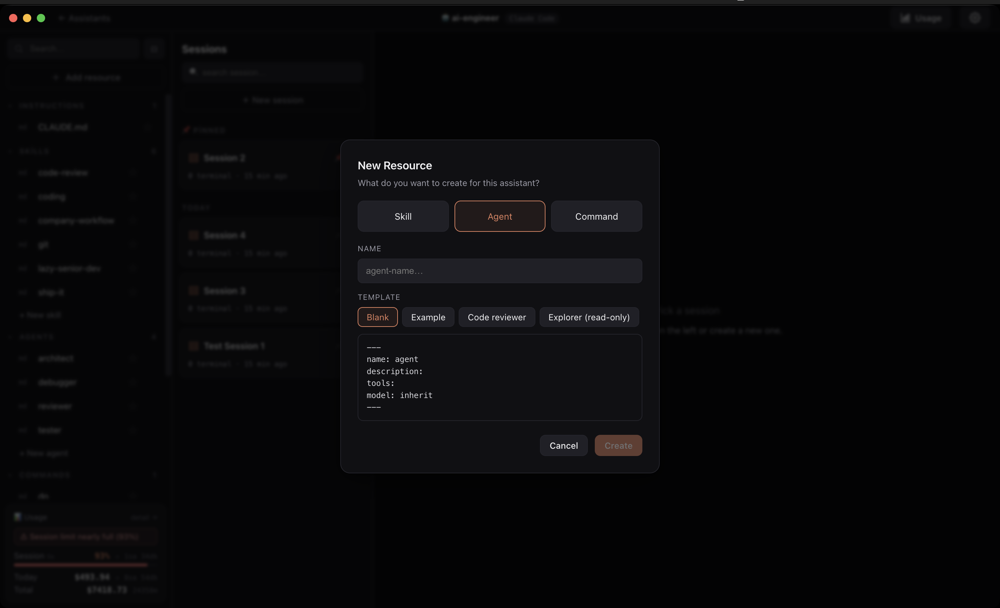
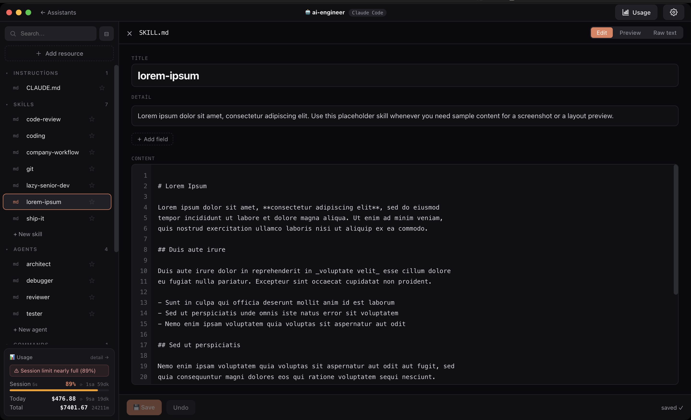
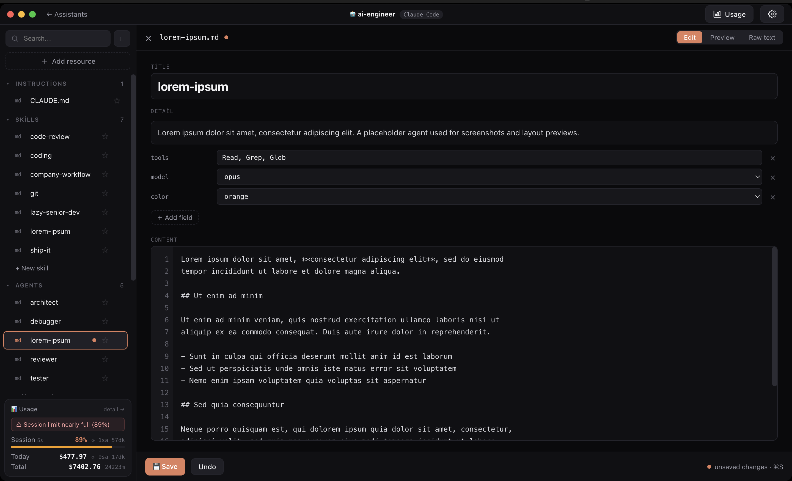
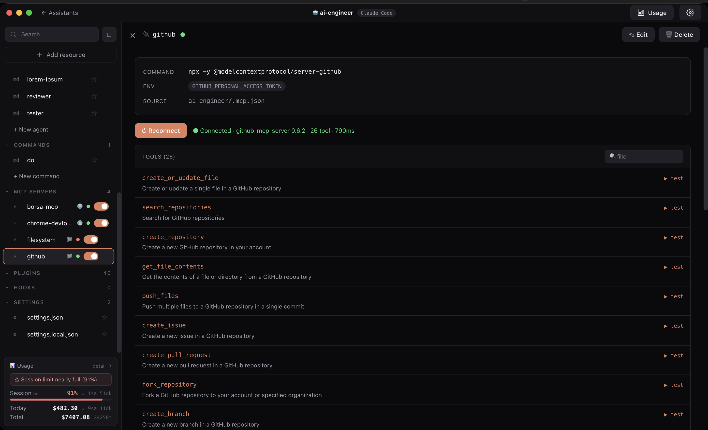

<h1 align="center">Archo</h1>

<p align="center">
  A macOS desktop app for building and running <a href="https://claude.com/claude-code">Claude Code</a> assistants.
</p>

<p align="center">
  
</p>

Archo is a control center for Claude Code. Create assistants — each backed by a real, runnable Claude Code project — give them their own skills, agents, commands, and MCP servers, then run and manage recorded terminal sessions for each one from a single window.

Built with Electron, React, and TypeScript.



---

## Features

### Assistants
- Create assistants, each stored as a real Claude Code project you can run
- Run, delete, and duplicate assistants
- Import / export assistants (including your global settings, theme, and language) to move between machines

### Resource editor
- Edit an assistant's **skills, agents, commands, and MCP servers** in-app
- YAML frontmatter editing with add/remove custom fields
- Edit / Preview / Raw modes with live Markdown preview
- Create resources from a template or by dropping a file in
- Favorites, drag-to-reorder, duplicate, and reveal-in-Finder

### Terminal sessions
- Named, resumable terminals per assistant with full recorded scrollback
- Resume previous Claude Code conversations
- Sessions bucketed by recency (Today, Yesterday, This week…) plus pinning, tags, and search
- Split-view to watch and work in two terminals side by side
- Smart links in terminal output — clickable URLs and `file:line` references

### Per-session Claude controls
- Set the working directory — pick a path with a recent-directories history, and add extra directories for `@path` references
- Pull files into context with the `@file` picker across multiple roots
- Pick the model (auto / Opus / Sonnet / Haiku) and reasoning effort, then launch a Claude session in one click
- Live context budget with cost and duration for the active session
- Git branch and "has changes" indicators
- Prompt library to save and re-send prompts to the active terminal
- Skill bridge — link an external repo so an assistant's skills apply there

### MCP
- Configure MCP servers at global and per-project scope
- Test a connection, list its tools, and test/run individual tools with parameters
- Enable or disable servers and plugins per assistant

### Usage
- Real plan usage (5-hour, 7-day, and 7-day Opus windows)
- Daily cost chart with per-model and per-project breakdowns

### Everywhere
- Command palette (⌘K) and find & replace (⌘⇧F)
- Desktop notifications when a run finishes, waits, or stops — click to jump straight to that session; in-app toasts for app events
- Dark / light theme and English / Turkish UI
- Automatic update check against GitHub Releases

---

## Screenshots

**Workbench** — resources on the left, sessions in the middle, live usage at a glance.



**One assistant, everything in place** — skills, agents, commands, MCP servers, plugins, hooks, and settings, all in one panel.



**Sessions** — named, resumable terminals per assistant, with model/effort selectors, `@file` context, and a running Claude session.



**Prompt library** — save reusable prompts and send them to the active terminal with one click.



**Create a resource** — start a skill, agent, or command from a template.



**Resource editor** — edit a skill's or agent's frontmatter and Markdown, with Edit / Preview / Raw modes.





**MCP** — configure servers at global and project scope, test the connection, and browse or run their tools.



---

## Install

### Homebrew (recommended)

```bash
brew install --cask imonursahin/tap/archo
```

Opens with no extra steps — the cask clears the quarantine flag on install.

### Manual

Download the latest `.dmg` from the [Releases](https://github.com/imonursahin/archo/releases) page, open it, and drag **Archo** into Applications. The app is unsigned, so the first launch needs **right-click → Open**, then confirm.

If macOS says **"Archo is damaged and can't be opened"**, that's Gatekeeper quarantining an unsigned download — the app is fine. Clear the quarantine flag once, then open it:

```bash
xattr -cr /Applications/Archo.app
```

Currently built for macOS on Apple Silicon (arm64).

---

## Development

```bash
npm install      # install deps and rebuild node-pty for your machine
npm run dev      # start the app with hot reload
npm run build    # type-check and build
npm run pack     # build an unpacked .app into dist/
npm run dist     # build .dmg + .zip installers into dist/
```

No API keys or secrets are required to build or run — `npm install` followed by any of the commands above works out of the box.

---

## Releasing

Releases are automated with GitHub Actions. Bump the version and push:

```bash
npm run ship 0.1.1
```

This bumps `package.json`, commits, and pushes. The [Release workflow](.github/workflows/release.yml) then builds the macOS installers and publishes a GitHub Release. Installed apps detect the new version on next launch.

> **Forking?** Publishing targets this repo. To release from your own fork, change the `publish` block in `package.json` and `UPDATE_REPO` in `src/main/index.ts` to point at your repo. Building and running locally needs no changes.

---

## License

MIT
